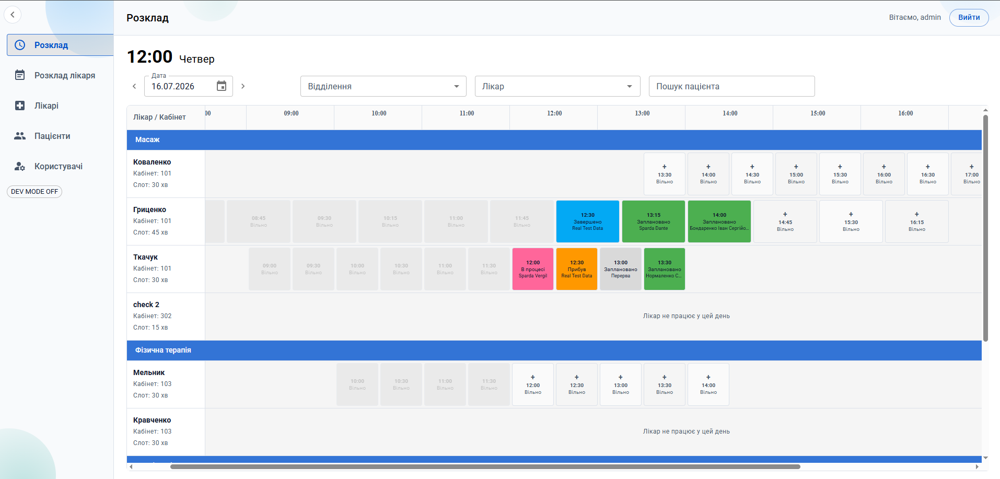
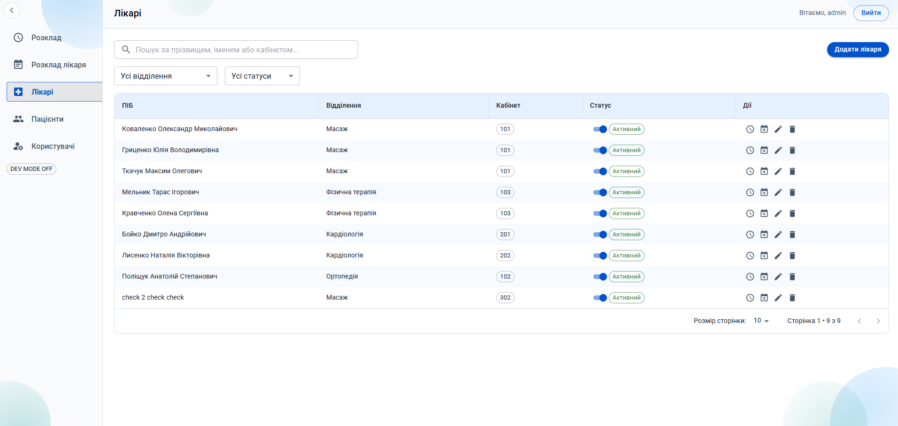
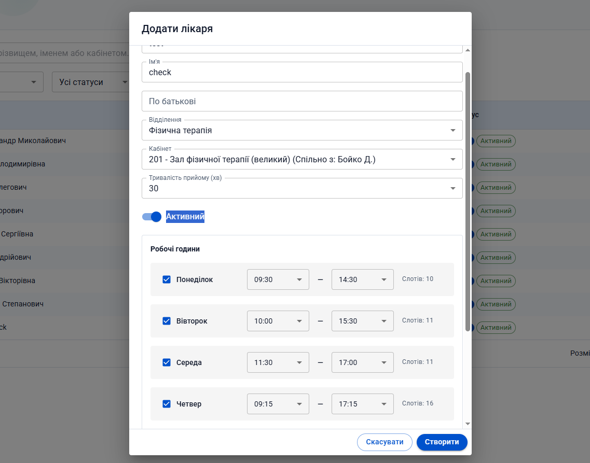
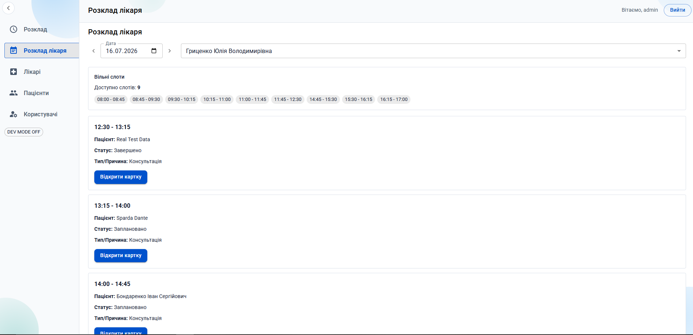
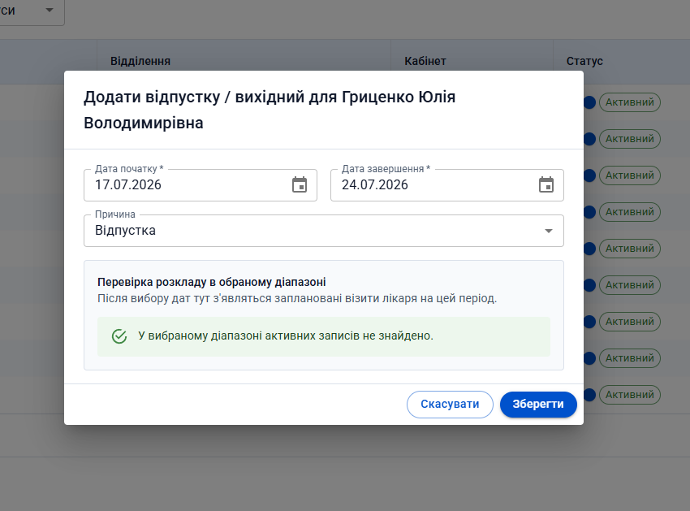
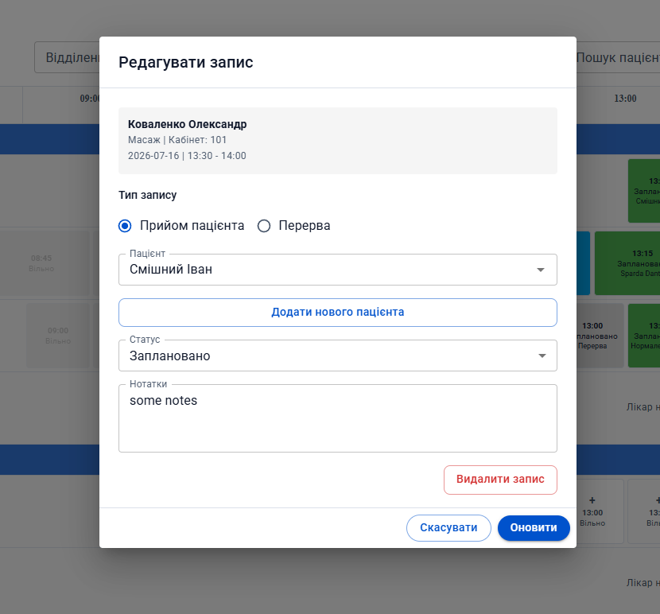
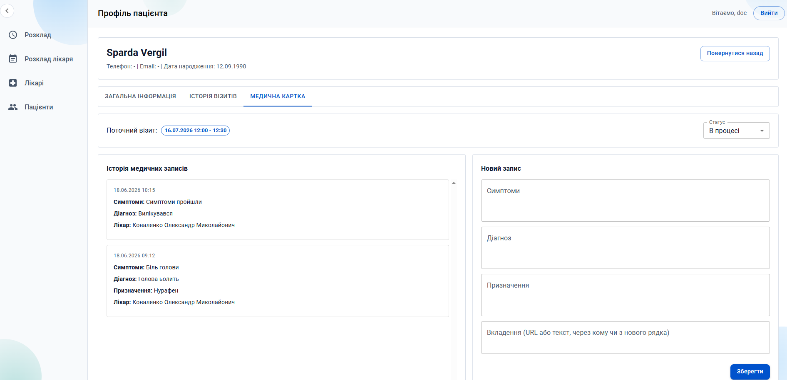
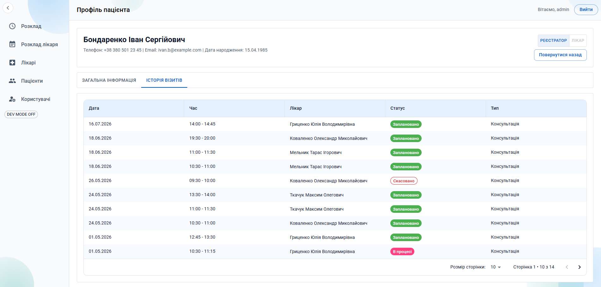
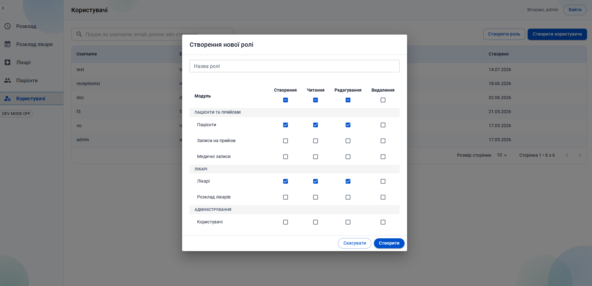

# Med system

This CRM system is designed to streamline polyclinic operations, specifically focusing on efficient schedule management for clinic staff. The application provides a centralized platform for medical personnel to manage appointments and resources, ensuring a smooth and organized workflow for daily clinic tasks.

- **Frontend**: React, MUI, Redux Toolkit, react-hook-form, zod
- **Backend**: Node, Express, SSE, jwt, Supabase integration
- **Tests**: UI, API - Jest, GitHub Actions

## Screenshots

### Schedule Management

View and manage doctor schedules with an interactive calendar and time slot system.

### Doctors

Browse all doctors with their department, room, and status information.

### Add Doctor

Create new doctor profiles with working hours configuration for each day of the week.

### Doctor Schedule

Detailed view of individual doctor's schedule and availability.

### Vacation Management

Manage doctor time-off and vacation periods.

### Appointment Editing

Update appointment details with status and notes.

### Medical Records

Access and manage patient medical records and history.

### Appointment History

Track appointment history and past interactions.

### User Roles & Permissions

Manage user roles and access control settings.
